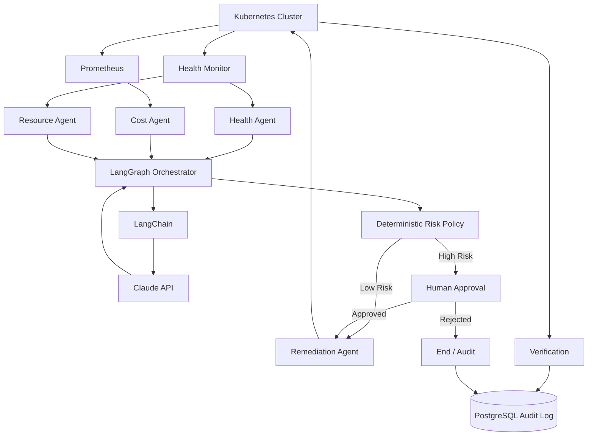
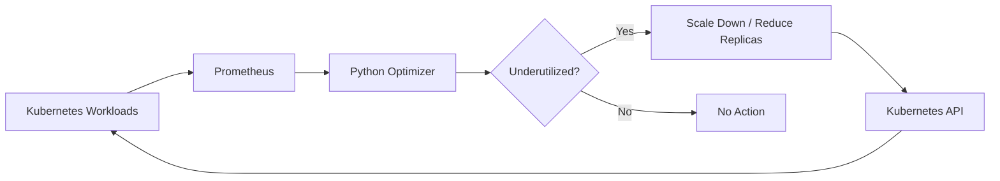
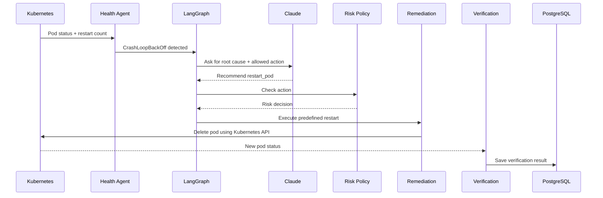
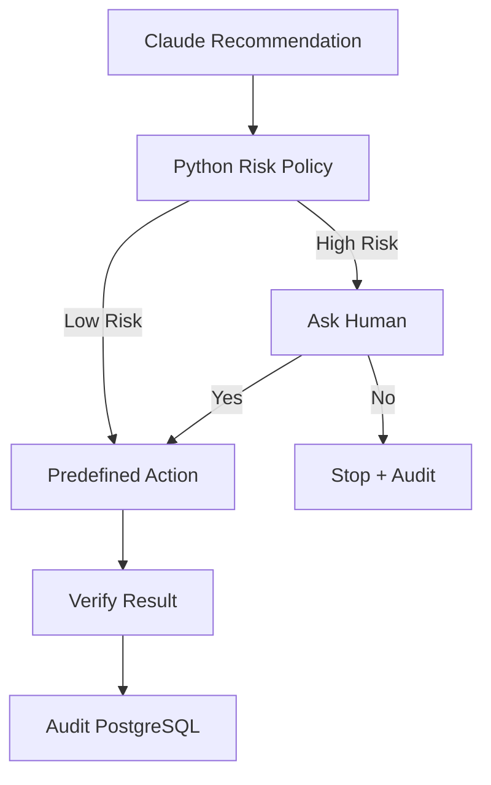

# 🤖 Kubernetes Self-Healing + Cost Optimization

This project started as a small Kubernetes FinOps / cost-optimization project. The original idea was simple: use Prometheus metrics to find underused workloads and reduce unnecessary resource usage.

I extended the same project with a **basic AI-assisted self-healing layer**. The goal is not to build a huge autonomous platform. It is to make the existing workflow a little smarter:

**Observe → Analyze → Decide → Act → Verify → Audit**

> The AI layer is intentionally simple and explainable. Claude only gives a recommendation. It does **not** get unrestricted Kubernetes access, and it cannot generate arbitrary `kubectl` commands.

---

## 🏗️ Overall Architecture

The complete flow is:



### In simple words

- **Kubernetes** is where our workloads actually run.
- **Prometheus** gives us CPU and memory-related metrics.
- **Health Monitor** checks pod status, restart count and basic events.
- **Health / Cost / Resource Agents** analyze different types of problems.
- **LangGraph** controls the order of the workflow.
- **LangChain** connects the agent/tool layer with Claude.
- **Claude** explains the likely problem and recommends one of the predefined actions.
- **Risk Policy** is normal Python code, so safety is not decided by the LLM.
- **Remediation Agent** performs only predefined Kubernetes operations.
- **Verification** checks whether the action actually helped.
- **PostgreSQL** stores what happened for auditing.

---

## 💰 Existing FinOps / Cost Optimization Flow

The original cost-optimization part is still present. It uses Prometheus + Python + Kubernetes SDK.



The optimizer can inspect workload metrics and replica information. This part remains rule-based and does not depend on AI.

---

## 🩺 Self-Healing Flow

For example, suppose a pod enters `CrashLoopBackOff`.



### Why this is useful

Instead of directly letting an LLM control Kubernetes, the system separates the responsibilities:

**AI = reasoning / recommendation**  
**Python policy = safety decision**  
**Kubernetes SDK = actual action**

This keeps the project easier to understand and safer to demonstrate in an interview.

---

## 🤖 Agents

### 1. Health Agent

`agents/health_agent.py`

It checks basic Kubernetes health information:

- Failed pods
- `CrashLoopBackOff`
- Restart count
- Basic Kubernetes events

It returns a small incident object that the orchestrator can work with.

### 2. Cost Agent

`agents/cost_agent.py`

This reuses the existing Prometheus-based optimizer and checks whether a workload looks underutilized.

Example idea:

`CPU is low + replicas > 1 → suggest scaling down`

### 3. Resource Agent

`agents/resource_agent.py`

This handles simple resource decisions:

- High CPU → suggest scale up
- Very low CPU → suggest scale down
- Normal usage → no action

No ML model is used here. The logic is intentionally simple.

### 4. Remediation Agent

`agents/remediation_agent.py`

This is the only layer that performs the actual Kubernetes change.

Currently the important operations are:

- Restart a pod
- Scale a deployment
- Verify pod/deployment state

The LLM does not execute shell commands.

---

## 🧠 LangGraph Workflow

`orchestrator/graph.py` keeps the workflow easy to follow:

```text
START
  ↓
Health Monitor
  ↓
Cost / Resource Analysis
  ↓
Claude Recommendation
  ↓
Risk Check
  ↓
Human Approval (only when required)
  ↓
Remediation
  ↓
Verification
  ↓
Audit Log
  ↓
END
```

The graph uses a shared state so each step can pass its result to the next step.

---

## 🔐 Risk & Human-in-the-Loop

AI should not be trusted with unrestricted infrastructure access.



The policy only allows known actions such as `restart_pod`, `scale_deployment` and `no_action`.

If an action is not allowed or is treated as high risk, the workflow does not blindly execute it.

---

## 🗄️ PostgreSQL Audit Log

Every processed incident can be recorded in the `incidents` table.

Important fields include:

- `timestamp`
- `namespace`
- `resource_name`
- `problem`
- `agent_recommendation`
- `ai_recommendation`
- `risk_level`
- `human_approval`
- `action_taken`
- `verification_status`

This makes it possible to answer a simple question later:

> **What happened, what did the system recommend, what action was taken, and did it work?**

---

## 📁 Project Structure

```text
kubernetes-cost-optimization/
│
├── agents/
│   ├── health_agent.py
│   ├── cost_agent.py
│   ├── resource_agent.py
│   └── remediation_agent.py
│
├── ai/
│   └── claude_service.py
│
├── database/
│   └── db.py
│
├── orchestrator/
│   └── graph.py
│
├── policy/
│   └── risk_policy.py
│
├── cronjobs/
│   └── nightly-shutdown.yaml
│
├── k8s-manifests/
│   ├── demo-app.yaml
│   └── rbac.yaml
│
├── scripts/
│   └── optimizer.py
│
├── .env.example
└── requirements.txt
```

---

## 🛠️ Tech Stack

| Area | Technology |
|---|---|
| Container orchestration | Kubernetes |
| Monitoring | Prometheus |
| Cost optimization | Python + Prometheus API |
| Kubernetes integration | Kubernetes Python SDK |
| AI | Claude API |
| AI tool connection | LangChain |
| Workflow orchestration | LangGraph |
| Database / audit | PostgreSQL |
| Scheduling | Kubernetes CronJob |
| Access control | Kubernetes RBAC |

---

## ⚙️ Setup

### 1. Start Kubernetes

```bash
minikube start --driver=docker --memory=3000 --cpus=2
kubectl get nodes
```

### 2. Install the demo workload

```bash
kubectl apply -f k8s-manifests/demo-app.yaml
kubectl get pods
```

### 3. Install Prometheus

```bash
helm repo add prometheus-community https://prometheus-community.github.io/helm-charts
helm repo update
kubectl create namespace monitoring
helm install prometheus prometheus-community/kube-prometheus-stack --namespace monitoring
```

### 4. Apply RBAC

```bash
kubectl apply -f k8s-manifests/rbac.yaml
```

### 5. Install Python dependencies

```bash
pip install -r requirements.txt
```

### 6. Configure environment variables

Copy `.env.example` to `.env` and set your values.

```env
ANTHROPIC_API_KEY=your_anthropic_api_key
CLAUDE_MODEL=claude-3-5-haiku-latest
POSTGRES_HOST=localhost
POSTGRES_PORT=5432
POSTGRES_DB=self_healing
POSTGRES_USER=postgres
POSTGRES_PASSWORD=change_me
```

Never commit a real API key to GitHub.

---

## ▶️ Running the Original Optimizer

The existing rule-based optimizer can still be run independently:

```bash
python scripts/optimizer.py
```

The nightly Kubernetes CronJob is also still part of the project:

```bash
kubectl apply -f cronjobs/nightly-shutdown.yaml
```

---

## 🧪 Example Incident

Imagine a workload has a pod with:

```text
Status: CrashLoopBackOff
Restarts: 5
Namespace: default
```

The basic workflow becomes:

```text
1. Health Agent detects the unhealthy pod
2. LangGraph sends the incident through the analysis flow
3. Claude explains the likely issue and recommends a predefined action
4. Python Risk Policy checks the recommendation
5. If approval is required, the CLI asks the user
6. Remediation Agent performs the allowed Kubernetes action
7. Verification checks the new pod state
8. PostgreSQL stores the incident and result
```

---

## 💡 Why AI Is Used Here

The original project already had deterministic rules for cost optimization.

AI is added mainly for the **reasoning layer**:

- Turn raw incident information into a short explanation
- Suggest an appropriate predefined action
- Give a human-readable reason for the recommendation

It is **not** being used to replace Kubernetes, Prometheus or normal Python safety rules.

---

## 🎯 What I Would Explain in an Interview

If asked about the project, the main idea is:

> **I started with a Kubernetes FinOps automation system that used Prometheus metrics and Python to identify underutilized workloads. I extended it with a basic self-healing workflow where health, cost and resource agents collect signals, LangGraph orchestrates the flow, Claude provides a recommendation, a deterministic Python policy checks the risk, and only predefined Kubernetes operations are executed. The result is then verified and stored in PostgreSQL for auditability.**

Some natural follow-up questions are:

- Why LangGraph instead of a normal Python function?
- Why should the LLM not have direct Kubernetes access?
- What is the role of LangChain here?
- How does the risk policy work?
- What happens if Claude returns an invalid action?
- Why do we need verification after remediation?
- Why PostgreSQL for the audit trail?
- How is this different from the original rule-based FinOps optimizer?

---

## ⚠️ Scope

This project is intentionally kept at a **basic interview/demo level**.

It does not try to build a production-grade autonomous Kubernetes controller. The focus is on understanding the architecture, agent responsibilities, AI integration, safety checks, remediation and verification without hiding everything behind a complicated framework.

---

## 🔁 Final Mental Model

```text
                    OBSERVE
                       ↓
              Kubernetes + Prometheus
                       ↓
                    ANALYZE
                       ↓
          Health / Cost / Resource Agents
                       ↓
                    DECIDE
                       ↓
             LangGraph + Claude
                       ↓
                Python Risk Policy
                       ↓
               ┌───────┴───────┐
               ↓               ↓
            Low Risk        High Risk
               ↓               ↓
          Auto Action     Human Approval
               └───────┬───────┘
                       ↓
                     ACT
                       ↓
              Kubernetes API/SDK
                       ↓
                   VERIFY
                       ↓
                    AUDIT
                       ↓
                  PostgreSQL
```

**The core idea is simple: don't let AI directly control the cluster. Let AI recommend, let Python decide what is safe, let predefined tools perform the action, and always verify the result.**